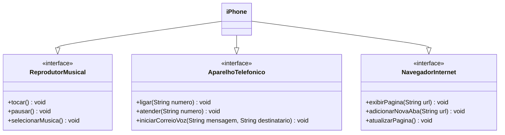

# Sobre o repositório:
Este repositório inclui a resolução de um desafio de projeto da trilha de Back-end Java do Santander Bootcamp 2024 pela [DIO](https://www.dio.me/), referente ao módulo de Modelagem e Diagramação com UML. 

#

## Modelando o iPhone com UML: Funções de Músicas, Chamadas e Internet
O projeto consiste numa aplicação de conceitos simples de modelagem de software com a finalidade de representar as funcionalidades básicas de um iPhone. Além da representação gráfica, o repositório conta também com as classes Java representadas no diagrama, para melhor entendimento.

#

### Diagrama UML de um iPhone

