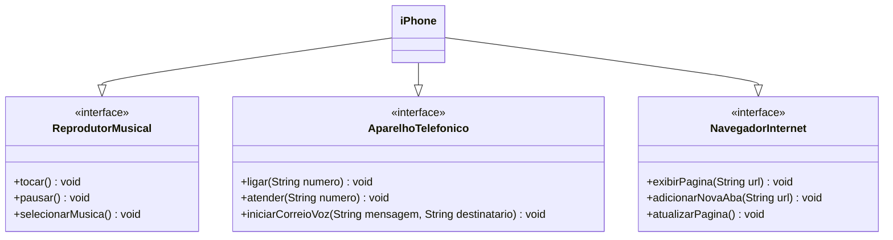

```mermaid
classDiagram
    iPhone --|> ReprodutorMusical
    iPhone --|> AparelhoTelefonico
    iPhone --|> NavegadorInternet

    class ReprodutorMusical{
      <<interface>>
      +tocar() void
      +pausar() void
      +selecionarMusica() void
    }

    class AparelhoTelefonico{
      <<interface>>
      +ligar(String numero) void
      +atender(String numero) void
      +iniciarCorreioVoz(String mensagem, String destinatario) void
    }

    class NavegadorInternet{
      <<interface>>
      +exibirPagina(String url) void
      +adicionarNovaAba(String url) void
      +atualizarPagina() void
    }
```